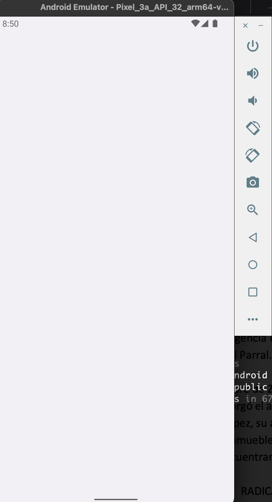

## Initial Splash Screen blank for Android Pixel_3a_API_32_arm64-v8a Emulator

This app was created using [`@capacitor/create-app`](https://github.com/ionic-team/create-capacitor-app),
and uses the assets from the [Capacitor Assets generator](https://github.com/ionic-team/capacitor-assets/tree/main/test/fixtures/app/assets)

### Running this example

To run the provided example, please do the following.

```bash
npm install
npx cap add android
npm run build
npm run assets
npx cap run android
```

The Splash Screen is configured to show for 5 seconds.

Notice that the intial Splash Screen is blank.
However, if you execute `SplashScreen.show()` (click on the Show Splash Screen button), the expected Splash Screen appears.

Why is the initial Splash Screen blank?


